 

  

<!-- Luminous Divider -->

### 🚀 About Me

  Amal Khiari is a passionate <strong>Full Stack Developer</strong> dedicated to building modern web platforms, innovative startups, and AI-driven digital ecosystems. I specialize in crafting ultra-premium, 3D-integrated user experiences backed by scalable cloud architectures, seamlessly bridging advanced backend capabilities in Python, Java, and Node.js with futuristic front-end designs.

### 🌐 Floating Tech Grid

  

### ⚡ Animated Core Competencies

  

### 🌟 Featured Architecture Showcase

<table>
  <tr>
    <td width="55%">
      <h3 align="center" style="color: #f4b4c4">🏡 Dream Home</h3>
      
<strong>Modern Real Estate Platform</strong>

      
A high-performance real estate platform engineered from the ground up utilizing the MERN stack. Designed with futuristic 2026 UI/UX glassmorphism principles, featuring elegant scalable architecture and smooth cinematic animations.

      

        
      

    </td>
    <td width="45%">
      
    </td>
  </tr>
</table>

### 📊 Matrix Analytics & Engineering Stats

  
  

  

  01001100 01101111 01100001 01100100 01101001 01101110 01100111

### 🐍 Contribution Activity Matrix

  <picture>
    <source media="(prefers-color-scheme: dark)" srcset="https://raw.githubusercontent.com/Amal-Khiari/Amal-Khiari/output/github-contribution-grid-snake-dark.svg">
    <source media="(prefers-color-scheme: light)" srcset="https://raw.githubusercontent.com/Amal-Khiari/Amal-Khiari/output/github-contribution-grid-snake.svg">
    
  </picture>

### 📡 Secure Connection Uplink

  Connect with me on GitHub

  

 

  

