 

  

### 🚀 About Me

  Amal Khiari is a passionate <strong>Full Stack Developer</strong> focused on building modern web platforms, cutting-edge startups, and AI-driven applications. I specialize in architecting sophisticated systems from the ground up, merging robust backend logic with elegant, cinematic user experiences spanning Python, Java, and the MERN stack.

### 💻 Tech Arsenal

  

### 🌟 Featured Architecture

<table>
  <tr>
    <td width="55%">
      <h3 align="center">🏡 Dream Home</h3>
      
<strong>Modern Real Estate Platform</strong>

      
A robust real estate platform engineered with the MERN stack, delivering elegant UI, state-of-the-art animations, and scalable cloud architecture.

      

        
      

    </td>
    <td width="45%">
      
    </td>
  </tr>
</table>

### 📊 Engineering Analytics

  
  

  

### 🐍 Contribution Matrix

  <picture>
    <source media="(prefers-color-scheme: dark)" srcset="https://raw.githubusercontent.com/Amal-Khiari/Amal-Khiari/output/github-contribution-grid-snake-dark.svg">
    <source media="(prefers-color-scheme: light)" srcset="https://raw.githubusercontent.com/Amal-Khiari/Amal-Khiari/output/github-contribution-grid-snake.svg">
    
  </picture>

### 📡 Initiate Connection

  Connect with me on GitHub

  

 

  

